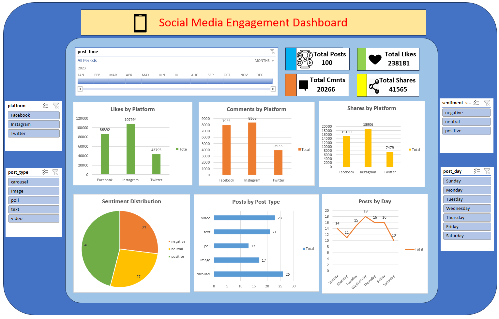

# Social Media Engagement Dashboard

## Project Overview

This project analyzes social media engagement data using Microsoft Excel. An interactive dashboard was created to understand engagement performance across different social media platforms and content types.

## Objective

The main objective of this project is to analyze social media engagement data and present meaningful insights using Excel dashboards, KPIs, Pivot Tables, Pivot Charts, and Slicers.

## Tools & Technologies

- Microsoft Excel
- Pivot Tables
- Pivot Charts
- Excel Formulas
- Slicers
- Data Cleaning
- Data Visualization
- Dashboard

## Key Features

- Data cleaning and preparation
- KPI analysis
- Interactive dashboard
- Platform-wise engagement analysis
- Post type analysis
- Sentiment analysis
- Pivot Tables and Pivot Charts
- Interactive Slicers
- Data visualization

## Dashboard

## Key Insights

- Analyzed social media engagement across different platforms.
- Compared engagement performance across different post types.
- Used KPIs to summarize important performance metrics.
- Used Pivot Tables and charts to analyze the dataset.
- Used Slicers to make the dashboard interactive.
- Analyzed sentiment and engagement patterns.

## Project Files

| File | Description |
|---|---|
| `Social_Media_Engagement_Dashboard.xlsx` | Complete Excel project containing the dataset, analysis and dashboard |
| `Dashboard.png` | Screenshot of the completed dashboard |

## Conclusion

This project helped me develop practical skills in data cleaning, Excel data analysis, dashboard creation, data visualization, Pivot Tables, Pivot Charts, and interactive reporting.
